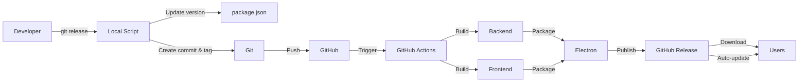

# Release Guide

This guide explains how to create and publish releases for ppop_promt using the automated CI/CD pipeline.

## Overview

The release process is fully automated. You simply run `git release` in your terminal, and the system will:
1. Prompt you to select a version bump type
2. Update the version in package.json
3. Create a git commit and tag
4. Push to GitHub
5. Trigger GitHub Actions to build and publish the release

## Prerequisites

### 1. Initial Setup (One-time)

Run the setup script to configure the git alias:

```bash
npm run setup:release
```

This will create a local git alias that allows you to use the `git release` command.

### 2. Environment Variables

Make sure you have a `.env` file in the project root with your GitHub token:

```env
GH_TOKEN=your_github_personal_access_token
```

### 3. GitHub Secrets

Add the following secret to your GitHub repository:
- Go to your repository on GitHub
- Navigate to Settings > Secrets and variables > Actions
- Add a new repository secret:
  - Name: `GH_TOKEN`
  - Value: Your GitHub Personal Access Token with `repo` scope

### 4. Code Signing Certificate (Optional)

If you want to sign your Windows executable:
- Place your `certificate.pfx` file in the project root
- Add the certificate password to your `.env` file:
  ```env
  CSC_KEY_PASSWORD=your_certificate_password
  ```

## Release Process

### Step 1: Prepare Your Code

Before creating a release, make sure:
- All your changes are committed
- Your working directory is clean
- You're on the `main` or `master` branch (recommended)

### Step 2: Run the Release Command

```bash
git release
```

### Step 3: Select Version Bump Type

The script will prompt you to select a version bump type:

- **Patch (1.0.0 -> 1.0.1)**: Bug fixes and minor changes
- **Minor (1.0.0 -> 1.1.0)**: New features, backward compatible
- **Major (1.0.0 -> 2.0.0)**: Breaking changes

Example:
```
Select version bump type:
  1) patch - Bug fixes (1.0.0 -> 1.0.1)
  2) minor - New features (1.0.0 -> 1.1.0)
  3) major - Breaking changes (1.0.0 -> 2.0.0)

Enter your choice (1/2/3 or patch/minor/major): 1
```

### Step 4: Confirm the Release

The script will show you the new version and ask for confirmation:

```
New version will be: 1.0.1

Proceed with release v1.0.1? (y/n): y
```

### Step 5: Automatic Build and Publish

Once you confirm:
1. The script updates `package.json` with the new version
2. Creates a git commit: `chore: release v1.0.1`
3. Creates a git tag: `v1.0.1`
4. Pushes the commit and tag to GitHub
5. GitHub Actions automatically starts building

### Step 6: Monitor the Build

You can monitor the build progress at:
```
https://github.com/heishia/ppop_promt/actions
```

The GitHub Actions workflow will:
1. Build the Python backend using PyInstaller
2. Build the React frontend using Vite
3. Package the Electron app
4. Create a GitHub Release
5. Upload the installer and update files

## What Gets Published

The release will include:
- `ppop_promt Setup [version].exe` - The installer
- `ppop_promt Setup [version].exe.blockmap` - For delta updates
- `latest.yml` - Update metadata for electron-updater

## Auto-Update

Users who already have the app installed will automatically receive update notifications thanks to `electron-updater`. The app will:
1. Check for updates on startup
2. Download updates in the background
3. Prompt the user to restart and install

## Troubleshooting

### "Not a git repository"
Make sure you're running the command from the project root directory.

### "You have uncommitted changes"
Commit or stash your changes before creating a release:
```bash
git add .
git commit -m "Your commit message"
```

### "Failed to push"
Make sure you have push access to the repository and your git credentials are configured.

### GitHub Actions Build Failed

Check the Actions tab on GitHub for detailed error logs. Common issues:
- Missing secrets (GH_TOKEN)
- Python dependencies not installing
- Node dependencies not installing
- Code signing certificate issues

### Release Already Exists

If a release with the same tag already exists on GitHub:
1. Delete the tag locally: `git tag -d v1.0.1`
2. Delete the tag remotely: `git push origin :refs/tags/v1.0.1`
3. Delete the release on GitHub (if created)
4. Run `git release` again

## Manual Release (Alternative)

If you prefer to create releases manually without the automated script:

```bash
# Update version in package.json manually
# Then run:
git add package.json
git commit -m "chore: release v1.0.1"
git tag -a v1.0.1 -m "Release v1.0.1"
git push
git push --tags
```

## Version Numbering Guidelines

Follow [Semantic Versioning](https://semver.org/):

- **MAJOR** version when you make incompatible API changes
- **MINOR** version when you add functionality in a backward compatible manner
- **PATCH** version when you make backward compatible bug fixes

## CI/CD Architecture



## Best Practices

1. **Test Before Release**: Always test your changes locally before creating a release
2. **Write Changelog**: Consider maintaining a CHANGELOG.md file
3. **Release Notes**: Edit the GitHub release after it's created to add detailed release notes
4. **Backup**: Keep backups of your code signing certificates
5. **Version Strategy**: Use patch for bug fixes, minor for features, major for breaking changes

## Support

If you encounter any issues with the release process:
1. Check the GitHub Actions logs
2. Review this guide
3. Check the project's issue tracker
4. Contact the development team

## Files Reference

- [`scripts/release.js`](scripts/release.js) - Main release automation script
- [`scripts/setup-release.js`](scripts/setup-release.js) - Git alias setup script
- [`.github/workflows/release.yml`](.github/workflows/release.yml) - GitHub Actions workflow
- [`package.json`](package.json) - Version management and build scripts
- [`backend/build_backend.py`](backend/build_backend.py) - Backend build script

